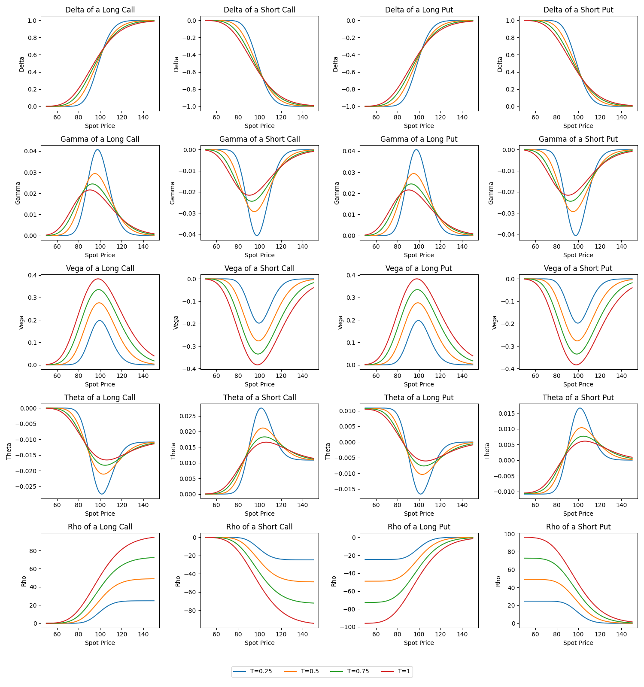

# Greek Graphs

Wanted to study the option greeks, ended on a side quest learning Cython and turning it into a small project.

The project contains analytical functions written in C for calculating the common greeks, a Cython wrapper and a Python script to visualize the greeks across multiple maturities and directions. Note that this project only covers analytical greeks of European options.

I hope this will be of use to you for your Quant/S&T interviews!



## So what even are these greeks?

A great deal has been written about them which is well beyond the scope of this. In their most basic form, the "greeks" are risk/sensitivity indicators which tell you something important about your option position(s) and how they respond to changes in market conditions.

| Greek | Measures sensitivity to… |
|-------|--------------------------|
| **Delta** (Δ) | Changes in the underlying spot price |
| **Gamma** (Γ) | Changes in Delta (second-order spot sensitivity) |
| **Vega** (ν) | Changes in implied volatility |
| **Theta** (Θ) | Passage of time (time decay) |
| **Rho** (ρ) | Changes in the risk-free interest rate |


Please refer to these amazing sources for further reading:
- **Option Volatility & Pricing** - Natenberg
- **Options, Futures & Other Derivatives** - Hull
- **The complete guide to option pricing formulas** - Haug
- **Financial Hacking** - Maymin

## Use and installation

- [A C compiler of your choice (I prefer clang)](https://clang.llvm.org/): For compiling the C code.
- [Cython](https://cython.org/): Needed to generate the C extension from `wrapper.pyx`.
- [NumPy](https://numpy.org/): Fast arrays for Python.
- [Matplotlib](https://matplotlib.org/): General purpose plotting.

Install the Python dependencies:

```sh
pip install cython numpy matplotlib
```

Build the Cython extension:

```sh
make build
# or manually:
python setup.py build_ext --inplace
```
This will compile lib.c and wrapper.pyx into a shared library (`wrapper.*.so`). At this point you can use this library in your Python projects as an import like how you would with NumPy or Pandas:

```py
import wrapper

s = 100
k = 110
t = 0.1
sigma = 0.2
r = 0.04
b = 0.04
direction = 1

delta = wrapper.delta_call(s, k, b, sigma, t, r, direction)

print(f"Call Delta: {delta:.4f}")
```

Alternatively you can use my script to generate the graphs yourself:
```sh
make graph
# or manually:
python graphs.py
```
This creates `option_greeks.png`, a 5×4 grid showing Delta, Gamma, Vega, Theta, and Rho for long/short calls and puts across 4 different maturities (T = 0.25, 0.50, 0.75, 1 years).

Lastly, you can remove some of the temporary files that were created:
```sh
make clean
```
## License

Greek Graphs is released under a **[MIT License](LICENSE)**